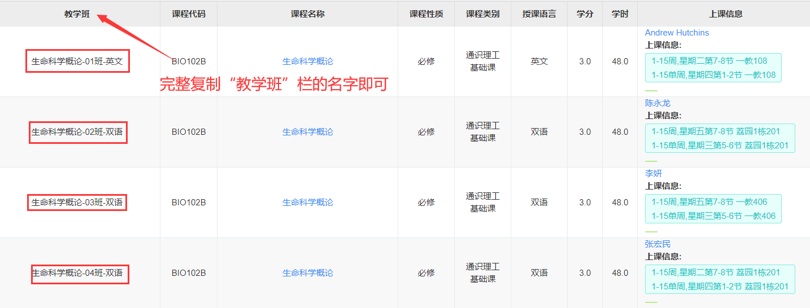
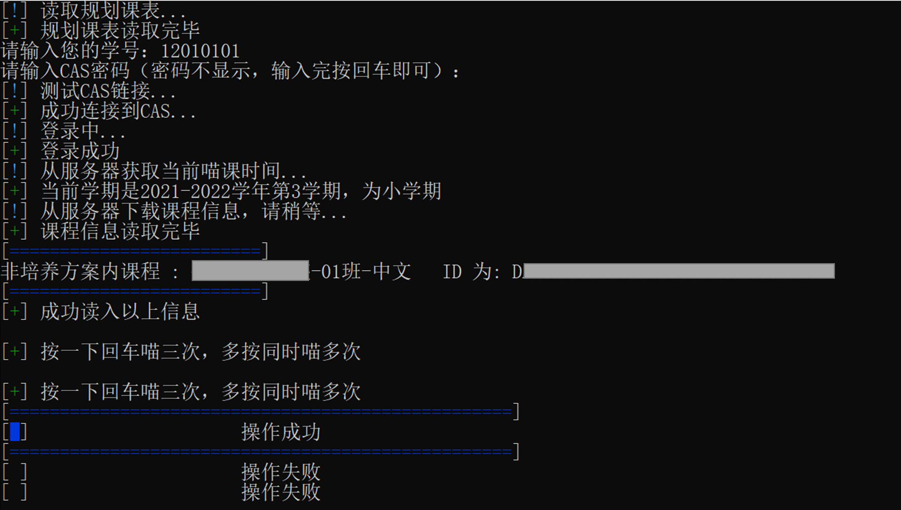

# 南科大Tis选课助手  
**2024 Sep 更新：Tis后台在用户级别做了流量限制**   
每个有效请求触发新的限制，因此大量发送数据不一定再是最优选择  
因此当前版本同时只选一门课（最重要的），选课队列优先级请参考使用说明  
**该程序未对流量特征做任何的混淆，追求隐蔽性请自行修改** (UA，请求参数，其他流量等)

如遇到学期服务器证书配置出错，兼容修改请参照issue手动修复

## 使用说明  
- main.py为Python3编写的主程序，运行即可  
- class.txt为需要选择的课程列表，一行一个数据，因编码问题，第一行请留空或不要编辑。  
**选课顺序会严格按照class.txt中录入的先后顺序进行，在高优先级课程被选完/冲突前不会选低优先级课程，除非手动输入任意值字符回车跳过**  
- 按下回车之后，会同时对当前队列里**最多3门不同的课程**各做几轮抢课（每门课由独立线程独占、每秒尝试一次左右）。并发中的课程不会被重复抢；已有3个线程在抢时，多余的按键会等待空位出现再补位。想继续抢就再按回车，输入任意字符再回车则跳过当前这门课。
- **本机改动说明**：原版受Tis用户级限流影响是"一次只抢一门（队首那门）"，本版放宽为"一次并发抢最多3门"。注意Tis仍做用户级限流，3门并发时瞬时请求频率约为原来的3倍，若频繁返回"频率过高"，请放慢按键节奏（间隔几秒）或改回一次一门。
- **固定时刻自动开抢（提高成功率）**：运行到"本次开抢时刻"提示时输入开放时间（如 `12:30:00`，可带日期），脚本会在登录并加载好课程后倒计时等待，**到点瞬间自动发出第一批请求**（无需人手卡点按回车），随后无人值守持续抢到队列清空。等待中每60秒自动保活会话；Ctrl+C 可取消等待转手动。直接回车则退回手动回车模式。建议提前 30 秒左右启动脚本，让它先完成登录和课程加载、再进入等待。
课程列表添加说明（图片加载不出请科学加载）：  
  
  脚本运行界面：

## 更新
最后一次**检测可用**是2026-09-05，检测结果是 **可用**  

## 声明

**该脚本诞生的目的是研究节省流量，减轻选课系统负担的方法，经过测试确实能达到该效果，因人为修改脚本产生的超过手工频率的流量，由修改者承担责任**  
>虽然Tis经过若干更新，网页端选课产生的流量已经大大减少，但该脚本仍产生更少的流量

### 免责声明
该脚本是通过抽象人对计算机的操作方法，提供节省流量并方便选课的功能。脚本为非营利性开源脚本，仅供个人学习、研究或欣赏使用，采用MIT协议，不具有任何市场价值。开发和使用过程不涉及对任何系统进行逆向破解/反汇编/反编译，本脚本编写使用的一切数据都来源于公开在互联网上的内容。  
本脚本不提供任何明示或暗示的保证，包括但不限于对适销性和特定用途的适用性的暗示保证。 在任何情况下，版权所有人或贡献者均不对任何直接，间接，偶发，特殊，示范性或后果性的损害负责。  
本脚本仅限用于合理合法的学习用途如网络环境测试，因本脚本而产生的各种后果由使用者自行承担，作者对此不负任何责任。  

